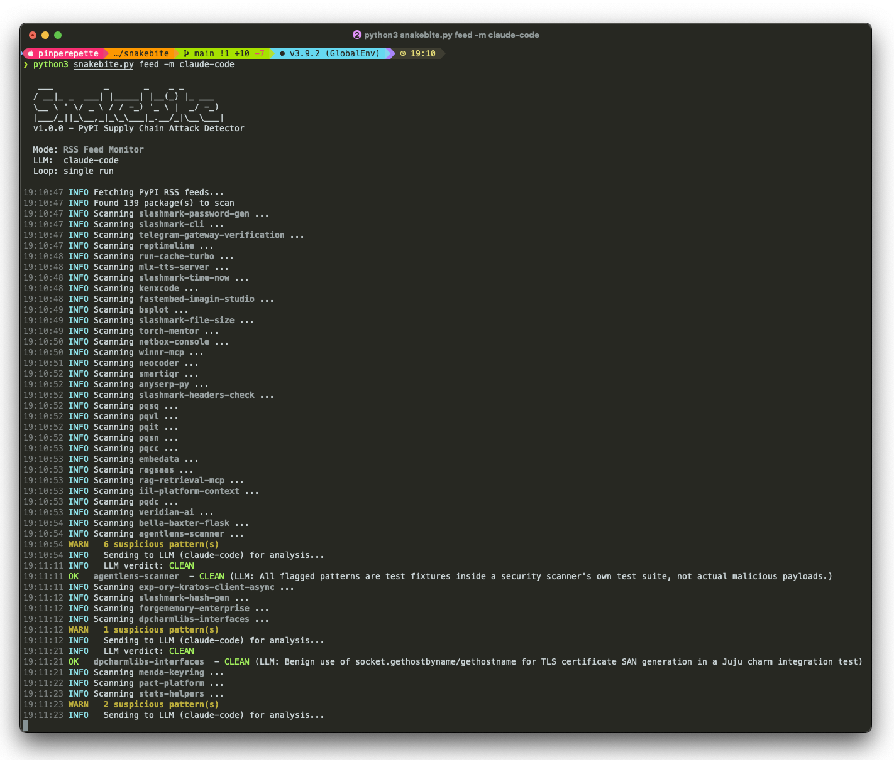

# snakebite

PyPI supply chain attack detector. Scans Python packages for malicious patterns (credential theft, code obfuscation, persistence mechanisms) and uses an LLM to filter out false positives.

```
   ___          _       _    _ _
  / __|_ _  ___| |_____| |__(_) |_ ___
  \__ \ ' \/ _ \ / / -_) '_ \ |  _/ -_)
  |___/_||_\__,_|_\_\___|_.__/_|\__\___|
```



## Why

On March 24 2026, `litellm` versions 1.82.7 and 1.82.8 were published to PyPI with a credential-stealing payload. A malicious `.pth` file executed automatically on every Python process startup — no import needed — and exfiltrated SSH keys, cloud credentials, crypto wallets, and Kubernetes secrets to an attacker-controlled domain. The package had 97 million monthly downloads.

Pure heuristic scanners flag patterns like `os.environ` or `subprocess` but drown you in false positives — legitimate packages use these all the time. snakebite solves this with a two-stage approach:

1. **14 heuristic rules** tuned to real attack patterns (not generic code smell)
2. **LLM-powered analysis** that reads the code in context and filters out legitimate usage

The LLM knows that `os.environ.get("AIOHTTP_NO_EXTENSIONS")` is a build toggle, not credential theft. That `subprocess.call([editor])` in an editor package is normal. That `base64.b64decode` in a test file is test data. You get signal, not noise.

## Install

```bash
git clone https://github.com/pinperepette/snakebite.git
cd snakebite
```

Zero external dependencies. Standard library only. Python 3.8+.

## Two modes

### `local` — scan what's installed on your machine

```bash
# Scan everything
python3 snakebite.py local

# Scan specific packages
python3 snakebite.py local flask requests litellm
```

Downloads each package from PyPI, extracts sdist + wheel, scans every `.py`, `.pth`, `setup.py`, `__init__.py`. If an LLM backend is configured, suspicious findings get analyzed before reporting.

### `feed` — monitor PyPI in real time

```bash
# Single scan of latest packages
python3 snakebite.py feed

# Continuous monitoring every 60 seconds
python3 snakebite.py feed --loop 60
```

Watches PyPI's RSS feeds for new and updated packages, downloads and scans each one. Leave it running to catch malicious packages as they're published — the same window attackers exploit before takedown.

## LLM backends

When you run snakebite without `-m`, it asks what you want to use:

```
  Select LLM backend for false positive filtering:

  1) claude-code   Claude Code CLI (subscription)
  2) claude        Anthropic API (ANTHROPIC_API_KEY)
  3) chatgpt       OpenAI API (OPENAI_API_KEY)
  4) ollama        Ollama local model
  5) none          Heuristics only, no LLM
```

Or specify directly:

```bash
python3 snakebite.py local -m claude-code            # Claude Code CLI (subscription)
python3 snakebite.py local -m claude                  # Anthropic API
python3 snakebite.py local -m chatgpt                 # OpenAI gpt-4o
python3 snakebite.py local -m chatgpt:gpt-4o-mini     # OpenAI specific model
python3 snakebite.py local -m ollama:qwen2.5:32b      # Ollama local
python3 snakebite.py local --no-llm                   # No LLM, heuristics only
```

### API keys

```bash
# Anthropic (for -m claude)
export ANTHROPIC_API_KEY="sk-ant-..."

# OpenAI (for -m chatgpt)
export OPENAI_API_KEY="sk-..."
```

Add the export lines to `~/.zshrc` or `~/.bashrc` to persist them.

**claude-code** uses your [Claude Code](https://claude.ai/code) subscription via the `claude` CLI. No API key needed.

**ollama** runs entirely local. Install [Ollama](https://ollama.ai), pull a model (`ollama pull qwen2.5:32b`), done.

## Architecture

```
┌─────────────┐     ┌──────────────┐     ┌────────────────┐     ┌─────────────┐
│  PyPI API   │────>│   Download   │────>│   Heuristic    │────>│  LLM filter │
│  / RSS feed │     │   & extract  │     │   engine       │     │  (optional) │
└─────────────┘     │  sdist+wheel │     │  14 rules      │     │             │
                    └──────────────┘     └───────┬────────┘     └──────┬──────┘
                                                │                      │
                                          no hits? ─> CLEAN      verdict:
                                                │              TRUE/FALSE POSITIVE
                                          hits found               │
                                                └──────────────────>│
                                                                    v
                                                              ┌──────────┐
                                                              │  Output  │
                                                              └──────────┘
```

1. **Fetch** — download sdist and/or wheel from PyPI (or get new packages via RSS)
2. **Extract** — unpack safely (path traversal protection, symlink filtering)
3. **Scan** — 14 regex-based heuristic rules against `.py`, `.pth`, `setup.py`, shell scripts
4. **Filter** — only if hits found: send code snippets + context to LLM for verdict
5. **Report** — CLEAN / LOW / MEDIUM / HIGH / CRITICAL with explanations

## What it detects

| Rule | Severity | Pattern |
|------|----------|---------|
| `PTH_EXEC` | CRITICAL | `.pth` files with executable code (the litellm vector) |
| `BASE64_NESTED` | CRITICAL | Nested base64 decoding (payload obfuscation) |
| `EXEC_ENCODED` | CRITICAL | `exec()`/`eval()` with encoded payloads |
| `SETUP_NETWORK` | CRITICAL | Network calls in `setup.py` / `__init__.py` / `.pth` |
| `CRED_HARVEST` | CRITICAL | Accessing SSH keys, AWS/GCP/Azure creds, kubeconfig |
| `CRYPTO_WALLET` | CRITICAL | Accessing Bitcoin/Ethereum/Solana wallet files |
| `K8S_SECRETS` | CRITICAL | Reading Kubernetes secrets or service account tokens |
| `PERSISTENCE` | CRITICAL | systemd/cron/launchd/shell rc persistence |
| `SETUP_SUBPROCESS` | HIGH | subprocess/os.system in setup/init files |
| `ENV_DUMP` | HIGH | Bulk environment variable collection in install context |
| `DNS_EXFIL` | HIGH | Cloud metadata endpoints (AWS IMDS, GCP, Alibaba) |
| `OBFUSCATION` | HIGH | chr() chains, reversed exec, dynamic base64 imports |
| `ARCHIVE_EXFIL` | HIGH | Archive creation + HTTP POST (data exfiltration) |
| `OPENSSL_ENCRYPT` | HIGH | OpenSSL encryption (exfil preparation) |

## Real-world detection: litellm 1.82.7

snakebite would catch the litellm supply chain attack with three CRITICAL findings:

```
======================================================================
  [CRITICAL] litellm 1.82.7
  LLM: Malicious .pth file executing obfuscated credential stealer at Python startup
======================================================================
  [CRITICAL] PTH_EXEC in litellm_init.pth:1
         import os, subprocess, sys; subprocess.Popen([sys.executable, "-c", "import base64; exec(...)"])
  [CRITICAL] CRED_HARVEST in litellm_init.pth:1
         .ssh/id_rsa, .aws/credentials, .kube/config
  [CRITICAL] BASE64_NESTED in litellm_init.pth:1
         exec(base64.b64decode(base64.b64decode(...)))
```

No LLM needed — the heuristics alone flag this as CRITICAL. The LLM confirms it's a true positive and adds context about the exfiltration mechanism.

## Threat model

snakebite detects:

- Supply chain attacks in Python packages published to PyPI
- Credential exfiltration (SSH, cloud, database, crypto) at install or import time
- Code obfuscation used to hide malicious payloads
- Persistence mechanisms embedded in packages (systemd, cron, launchd)
- `.pth` file abuse for pre-import code execution
- Kubernetes lateral movement from compromised packages

snakebite does **not** detect:

- Malicious compiled extensions (`.so`, `.pyd`, `.dll`) — binary analysis is out of scope
- Runtime-only attacks triggered by specific input or conditions
- Logic bombs without static indicators
- Typosquatting or dependency confusion (use [pip-audit](https://github.com/pypa/pip-audit) for that)
- Attacks outside the Python/PyPI ecosystem
- Vulnerabilities in legitimate code (use [bandit](https://github.com/PyCQA/bandit) or [safety](https://github.com/pyupio/safety))

## LLM usage and privacy

When a package triggers heuristic rules, snakebite sends **only the suspicious code snippets** (a few lines of context around each hit) to the selected LLM backend. It does **not** send:

- Full package source code
- Your system information
- Your credentials or environment variables
- Package contents that passed heuristic checks

If this is a concern:

- Use `ollama` — everything stays on your machine
- Use `--no-llm` — no external calls at all, pure heuristic analysis
- Review what gets sent: run with `--verbose` to see the exact code excerpts

## Performance

| Mode | Speed | Notes |
|------|-------|-------|
| Heuristics only (`--no-llm`) | ~1-2s per package | Download + extract + regex scan |
| With LLM | ~5-15s per package | Depends on backend and model |
| RSS feed (`--loop 60`) | ~40 packages/cycle | PyPI publishes ~40 packages per RSS fetch |

The LLM is the bottleneck. `claude-code` and API backends (claude, chatgpt) are faster than local models. Ollama speed depends on your hardware and model size.

Heuristic-only mode is fast enough for full local scans (hundreds of packages in minutes).

## Comparison

| Tool | Approach | LLM filtering | Supply chain focus | False positives |
|------|----------|---------------|-------------------|-----------------|
| **snakebite** | Heuristic + LLM | yes | yes | low (LLM filters) |
| [bandit](https://github.com/PyCQA/bandit) | AST analysis | no | no (general code quality) | high |
| [pip-audit](https://github.com/pypa/pip-audit) | Vulnerability DB | no | partial (known CVEs only) | low |
| [safety](https://github.com/pyupio/safety) | Vulnerability DB | no | partial (known CVEs only) | low |
| [packj](https://github.com/ossillate-inc/packj) | Heuristic | no | yes | medium-high |

pip-audit and safety catch **known** vulnerabilities. snakebite catches **unknown** malicious code — the zero-day supply chain attack that hasn't been reported yet.

## CI integration

Scan dependencies before deploy:

```bash
# In your CI pipeline
pip install -r requirements.txt
python3 snakebite.py local --no-llm
```

With LLM (set the API key in CI secrets):

```bash
export ANTHROPIC_API_KEY="${{ secrets.ANTHROPIC_API_KEY }}"
python3 snakebite.py local -m claude
```

Scan a requirements file without installing:

```bash
cat requirements.txt | cut -d'=' -f1 | xargs python3 snakebite.py local
```

GitHub Actions example:

```yaml
- name: Scan dependencies for supply chain attacks
  run: |
    pip install -r requirements.txt
    python3 snakebite.py local --no-llm
```

## Options

```
-m, --model     LLM backend (claude-code, claude, chatgpt, ollama:<model>)
--no-llm        Heuristics only, skip LLM analysis
-v, --verbose   Show clean packages and false positive details
--version       Show version
```

Feed mode:

```
--loop N        Repeat scan every N seconds (default: single run)
```

## Example output

Clean (false positive filtered by LLM):

```
18:30:54 OK   astroid 3.3.10 - CLEAN (LLM: Benign setuptools namespace package .pth files)
18:31:22 OK   babel 2.16.0 - CLEAN (LLM: Legitimate CLDR data import in setup.py, not executed during install)
18:31:39 OK   banks 2.2.0 - CLEAN (LLM: Benign test code verifying base64 encoding of image data URLs)
```

Suspicious:

```
======================================================================
  [CRITICAL] evil-package 0.1.0
  LLM: Credential stealer targeting SSH keys and cloud provider tokens
======================================================================
  ! CRED_HARVEST: Reads SSH private keys and AWS credentials, concatenates into single payload
  ! SETUP_NETWORK: POSTs collected credentials to external domain during pip install
  ! ENV_DUMP: Captures all environment variables including API tokens
```

## License

MIT
